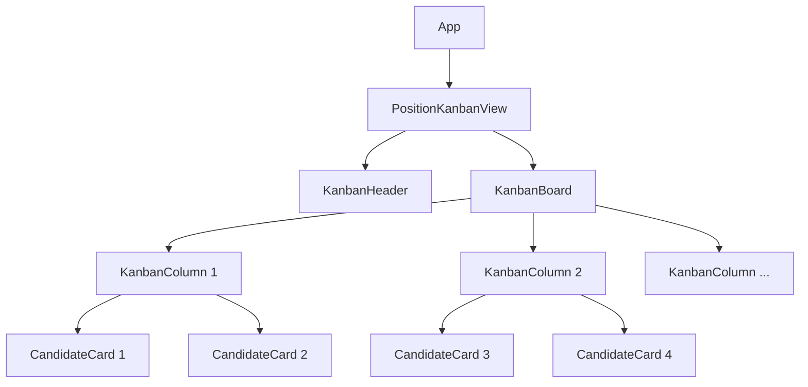
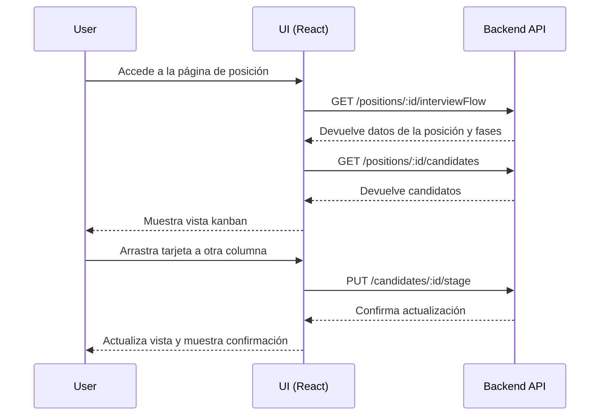

# Diseño: Position Kanban View

## Overview

La "Position Kanban View" es una interfaz tipo kanban que permite visualizar y gestionar los candidatos de una posición específica. Los candidatos se muestran como tarjetas organizadas en columnas que representan las diferentes fases del proceso de contratación. La interfaz permite arrastrar y soltar las tarjetas entre columnas para actualizar la fase en la que se encuentra cada candidato.

## Arquitectura

La funcionalidad se implementará siguiendo la arquitectura actual de la aplicación, que separa claramente el frontend del backend:

1. **Frontend**: Componente React que implementa la vista kanban, utilizando una biblioteca de arrastrar y soltar para la funcionalidad de movimiento de tarjetas.
2. **Backend**: API REST existente que proporciona los endpoints necesarios para obtener datos de posiciones, candidatos y actualizar el estado de los candidatos.

## Componentes e Interfaces

### Componentes principales

1. **PositionKanbanView**: Componente principal que renderiza la vista kanban completa.
   - Responsabilidades:
     - Obtener datos de la posición y sus fases
     - Obtener datos de los candidatos
     - Manejar la lógica de arrastrar y soltar
     - Actualizar el estado de los candidatos

2. **KanbanColumn**: Componente que representa una columna del kanban.
   - Responsabilidades:
     - Mostrar el título de la fase
     - Contener las tarjetas de candidatos
     - Manejar la lógica de recibir tarjetas arrastradas

3. **CandidateCard**: Componente que representa la tarjeta de un candidato.
   - Responsabilidades:
     - Mostrar información del candidato (nombre, puntuación)
     - Manejar la lógica de ser arrastrado

### Interfaces de datos

```typescript
// Interfaces para los datos recibidos de la API
interface InterviewStep {
  id: number;
  interviewFlowId: number;
  interviewTypeId: number;
  name: string;
  orderIndex: number;
}

interface InterviewFlow {
  id: number;
  description: string;
  interviewSteps: InterviewStep[];
}

interface PositionFlow {
  positionName: string;
  interviewFlow: InterviewFlow;
}

interface Candidate {
  id: number;
  fullName: string;
  currentInterviewStep: string;
  averageScore: number;
}

// Interfaces para los datos enviados a la API
interface UpdateCandidateStageRequest {
  applicationId: string;
  currentInterviewStep: string;
}

interface UpdateCandidateStageResponse {
  message: string;
  data: {
    id: number;
    positionId: number;
    candidateId: number;
    applicationDate: string;
    currentInterviewStep: number;
    notes: string | null;
    interviews: any[];
  };
}
```

## Flujo de datos

1. Al cargar el componente:
   - Se obtiene el ID de la posición de los parámetros de la URL
   - Se realiza una petición a `/positions/:id/interviewFlow` para obtener información sobre la posición y sus fases
   - Se realiza una petición a `/positions/:id/candidates` para obtener los candidatos de la posición
   - Se renderiza la vista kanban con las columnas y tarjetas correspondientes

2. Al arrastrar una tarjeta:
   - Se captura el evento de inicio de arrastre
   - Se aplican estilos visuales para indicar que la tarjeta está siendo arrastrada

3. Al soltar una tarjeta en una columna:
   - Se captura el evento de soltar
   - Se identifica la columna destino
   - Se realiza una petición PUT a `/candidates/:id/stage` con los datos actualizados
   - Si la petición es exitosa, se actualiza el estado local
   - Si la petición falla, se muestra un mensaje de error y se revierte el cambio visual

## Biblioteca de arrastrar y soltar

Para implementar la funcionalidad de arrastrar y soltar, utilizaremos la biblioteca `react-beautiful-dnd`, que proporciona una API declarativa para implementar interfaces de arrastrar y soltar accesibles y con buen rendimiento.

Características clave de `react-beautiful-dnd`:
- Soporte para teclado y lectores de pantalla
- Animaciones fluidas
- Soporte para dispositivos táctiles
- API sencilla y declarativa

## Diseño responsive

El diseño se adaptará a diferentes tamaños de pantalla:

1. **Escritorio (> 768px)**:
   - Las columnas se mostrarán en horizontal, ocupando el ancho disponible
   - Se utilizará un sistema de grid para distribuir las columnas equitativamente

2. **Móvil (≤ 768px)**:
   - Las columnas se mostrarán en vertical, una debajo de otra
   - Cada columna ocupará el ancho completo de la pantalla
   - Se añadirá un sistema de navegación entre columnas para facilitar el uso

## Manejo de errores

1. **Error al cargar datos iniciales**:
   - Se mostrará un mensaje de error en la interfaz
   - Se proporcionará un botón para reintentar la carga

2. **Error al actualizar la fase de un candidato**:
   - Se mostrará un mensaje de error
   - Se revertirá visualmente el cambio (la tarjeta volverá a su columna original)
   - Se proporcionará la opción de reintentar la actualización

## Estrategia de pruebas

1. **Pruebas unitarias**:
   - Pruebas de renderizado de componentes
   - Pruebas de lógica de negocio (filtrado de candidatos por fase, etc.)

2. **Pruebas de integración**:
   - Pruebas de interacción entre componentes
   - Pruebas de integración con la API (mock)

3. **Pruebas de usuario**:
   - Pruebas de arrastrar y soltar en diferentes dispositivos
   - Pruebas de accesibilidad

## Diagrama de componentes



## Diagrama de flujo de interacción

